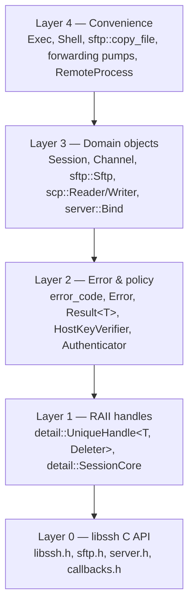
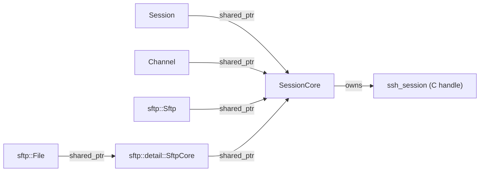

# 02 — Architecture

## 2.1 Layering



Rules:

* A layer may only depend on layers below it.
* Layer 4 is **strictly optional sugar**: everything it does can be done with Layer 3.
  It lives in separate headers so users who do not want it pay nothing.
* Layer 0 symbols never appear in public headers (see §2.4).

## 2.2 Ownership and lifetime model

libssh has a hard destruction-ordering requirement: `ssh_free(session)` invalidates every
channel and SFTP session derived from it, and `ssh_channel_free` must happen *before*
`ssh_free`. A naive wrapper where `Channel` stores a raw `ssh_channel` and `Session` stores a
raw `ssh_session` lets users write dangling code that compiles fine.

### Decision: shared session core

```cpp
namespace sshpp::detail {

// Non-copyable, non-movable; always heap-allocated and shared.
class SessionCore {
public:
    explicit SessionCore(ssh_session raw) noexcept;
    ~SessionCore();                       // ssh_disconnect + ssh_free, last one out

    ssh_session raw() const noexcept { return raw_; }

    // libssh sessions are NOT thread-safe: one session = one logical lock.
    std::recursive_mutex& mutex() noexcept { return mutex_; }

    bool valid() const noexcept { return raw_ != nullptr; }
    void invalidate() noexcept;           // used by Session::release()

private:
    ssh_session raw_;
    std::recursive_mutex mutex_;
    std::atomic<bool> cancel_requested_{false};
    LogSink log_sink_;                    // per-session log callback (0.11) or global fallback
};

using SessionCorePtr = std::shared_ptr<SessionCore>;

} // namespace sshpp::detail
```

* `Session` holds a `SessionCorePtr` (**strong**).
* `Channel`, `sftp::Sftp`, `scp::Reader/Writer`, `RemoteForwardListener` each hold their own
  `SessionCorePtr` (**strong**).
* `sftp::File` / `sftp::Dir` hold a strong ref to the `sftp::Sftp` internals, which in turn
  holds the `SessionCorePtr`.

**Consequence:** a `Channel` keeps the session alive. `Session` going out of scope while a
`Channel` lives does *not* free the `ssh_session`; the last owner frees it. This trades a
"surprising" extended lifetime for guaranteed memory safety, which is the right trade for a
security-adjacent library.

`Session::disconnect()` is separate from destruction: it sends the disconnect message and marks
the core disconnected, but memory is still freed only by the last owner. Operations on a
`Channel` after `Session::disconnect()` fail with `error_code::not_connected` rather than
crashing.



### Handle wrapper

Every other libssh handle that has a clean single-owner lifetime uses a zero-overhead unique
wrapper:

```cpp
namespace sshpp::detail {

template <class Handle, class Deleter>
class UniqueHandle {
public:
    UniqueHandle() = default;
    explicit UniqueHandle(Handle h) noexcept : h_(h) {}
    UniqueHandle(UniqueHandle&& o) noexcept : h_(std::exchange(o.h_, nullptr)) {}
    UniqueHandle& operator=(UniqueHandle&& o) noexcept;
    ~UniqueHandle() { if (h_) Deleter{}(h_); }

    UniqueHandle(const UniqueHandle&)            = delete;
    UniqueHandle& operator=(const UniqueHandle&) = delete;

    Handle get() const noexcept        { return h_; }
    explicit operator bool() const noexcept { return h_ != nullptr; }
    [[nodiscard]] Handle release() noexcept { return std::exchange(h_, nullptr); }
    void reset(Handle h = nullptr) noexcept;

private:
    Handle h_ = nullptr;
};

} // namespace sshpp::detail
```

Used for `ssh_key`, `ssh_message`, `ssh_string`, `ssh_buffer`, `ssh_event`, `ssh_bind`,
`sftp_attributes`, `sftp_statvfs_t`, `ssh_pcap_file`.

### Ownership policy for adoption

Every domain type provides:

```cpp
enum class Ownership { owning, borrowed };

static Channel from_native(ssh_channel raw, const Session& parent, Ownership o);
ssh_channel native_handle() const noexcept;
[[nodiscard]] ssh_channel release() noexcept;   // give up ownership, wrapper becomes empty
```

`Ownership::borrowed` is required for the server callback API, where libssh hands you channels
it still owns.

## 2.3 Move-only, never copyable

All handle-owning types are **move-only**. Copying an SSH session or channel is meaningless.
`SessionOptions`, `sftp::Attributes`, `Fingerprint`, `KnownHostsEntry` and other value types
*are* copyable.

Moved-from objects are in a valid, empty state: `explicit operator bool()` returns `false`, and
any operation returns/throws `error_code::invalid_handle`.

## 2.4 Hiding the C API

Public headers must not include `<libssh/libssh.h>` (NFR-4). Reasons: libssh's headers pull in
`<winsock2.h>` / `<sys/socket.h>`, define macros like `SSH_OK`/`SSH_ERROR` that collide, and
would force every consumer onto libssh's include path even in header-only distributions of
downstream code.

Technique — forward-declare the opaque struct pointers in a private header:

```cpp
// include/sshpp/detail/native_fwd.hpp
namespace sshpp {
// libssh's public typedefs are `struct ssh_session_struct*` etc.
using native_session  = struct ssh_session_struct*;
using native_channel  = struct ssh_channel_struct*;
using native_key      = struct ssh_key_struct*;
using native_bind     = struct ssh_bind_struct*;
using native_message  = struct ssh_message_struct*;
using native_event    = struct ssh_event_struct*;
using native_sftp     = struct sftp_session_struct*;
using native_sftp_file= struct sftp_file_struct*;
using native_sftp_dir = struct sftp_dir_struct*;
using native_scp      = struct ssh_scp_struct*;
} // namespace sshpp
```

These are *exactly* the types libssh typedefs, so `native_session` and `ssh_session` are the
same type and interconvert without a cast. A static assertion in the `.cpp` files
(`static_assert(std::is_same_v<native_session, ssh_session>)`) guards against libssh changing
its definitions.

Enums that appear in the public API (key types, log levels, SFTP error codes, auth methods) are
**re-declared** as `enum class` in `sshpp` with explicit values, and a `constexpr` translation
table in the `.cpp` maps them, with `static_assert`s pinning each value to the libssh macro.
This is verified by `tests/unit/enum_mapping_test.cpp`.

## 2.5 Threading model

| Object | Guarantee |
|--------|-----------|
| `sshpp::Library` | Thread-safe; idempotent; must be alive before any other object |
| `Session` and everything derived from it (`Channel`, `sftp::*`, `scp::*`) | **Not** thread-safe as a group. All of them share one `SessionCore` mutex. |
| Distinct `Session`s | Fully independent; safe to use concurrently from different threads |
| Value types (`SessionOptions`, `Attributes`, `Key`) | As-if `const` — safe to read concurrently |

Two modes, chosen at construction via `SessionOptions::locking`:

* `Locking::none` (default) — no internal locking; the caller must not touch the session tree
  from two threads. Zero overhead. Debug builds insert a thread-affinity assertion.
* `Locking::internal` — every public call takes `SessionCore::mutex()`. Makes the session tree
  safe to share, at the cost of coarse serialization. Required if you want to `read()` on a
  channel in one thread while `write()`ing in another (libssh does not support true parallel
  I/O on one session, so calls interleave rather than overlap).

`Library` installs libssh's native threading callbacks (`ssh_threads_get_pthread()` /
`ssh_threads_get_native()`) once, which is what makes multiple concurrent sessions safe.

**Cancellation.** `Session::request_cancel()` is the only method callable from another thread
in `Locking::none` mode. It sets an atomic flag and, if the session is in a blocking libssh
call, breaks it via the registered poll-based interrupt (self-pipe added to the session's
`ssh_event`). Subsequent calls fail with `error_code::cancelled` until
`Session::clear_cancel()`.

## 2.6 Blocking, timeouts and `SSH_AGAIN`

v1 is synchronous. Sessions are created in blocking mode. Timeouts map as follows:

| API shape | libssh mechanism |
|---|---|
| `SessionOptions::timeout` | `SSH_OPTIONS_TIMEOUT` + `SSH_OPTIONS_TIMEOUT_USEC` — applies to connect and all blocking reads |
| `Channel::read_some(buf, timeout)` | `ssh_channel_read_timeout` |
| `Channel::wait_readable(timeout)` | `ssh_channel_poll_timeout` |
| `Event::poll(timeout)` | `ssh_event_dopoll` |

A timeout expiry is **not** an exception in `try_*` form; it returns
`error_code::timed_out`. The throwing form throws `TimeoutError`. `SSH_AGAIN` is only visible
to users who explicitly opt into non-blocking mode via `Session::set_blocking(false)`, in which
case it maps to `error_code::would_block`.

## 2.7 Buffers and string types

* Input byte ranges: `sshpp::ByteView` = `span<const std::byte>` shim (aliases `std::span`
  under C++20). Convenience overloads accept `std::string_view` and
  `const std::vector<std::byte>&`.
* Output byte ranges: `sshpp::MutableByteView`.
* Text (hostnames, usernames, commands, banners): `std::string_view` in, `std::string` out.
* Remote paths: a dedicated `sshpp::RemotePath` (thin `std::string` wrapper, always `/`
  separated) — **not** `std::filesystem::path`, because on Windows `path` would mangle
  separators. `std::filesystem::path` is used only for *local* paths.
* Secrets (passwords, passphrases): `sshpp::SecureString` — a `std::basic_string` with an
  allocator that `explicit_bzero`/`SecureZeroMemory`s on deallocation, plus deleted
  `operator<<`. Password-taking APIs accept `SecureString` or `std::string_view` (the latter
  documented as caller's responsibility).

## 2.8 Directory layout

```
libsshpp/
├── CMakeLists.txt
├── CMakePresets.json
├── conanfile.py                  # recipe (also usable as consumer via `conan build`)
├── LICENSE                       # LGPL-2.1
├── THIRD_PARTY_NOTICES.md
├── README.md
├── CHANGELOG.md
├── cmake/
│   ├── libsshppConfig.cmake.in
│   ├── CompilerWarnings.cmake
│   ├── Sanitizers.cmake
│   ├── FindLibssh.cmake           # fallback when Conan/CONFIG mode unavailable
│   └── libsshpp-header-only.cmake
├── include/sshpp/
│   ├── sshpp.hpp                  # umbrella header
│   ├── config.hpp                 # generated: version + feature macros
│   ├── export.hpp                 # generated: SSHPP_API visibility macros
│   ├── fwd.hpp                    # forward declarations of every public type
│   ├── library.hpp                # Library, logging, feature query
│   ├── error.hpp                  # error_code, error_category, Error hierarchy
│   ├── result.hpp                 # Result<T>, Result<void>
│   ├── types.hpp                  # ByteView, RemotePath, SecureString, enums
│   ├── session.hpp
│   ├── session_options.hpp
│   ├── auth.hpp                   # Authenticator interface + built-ins
│   ├── key.hpp
│   ├── known_hosts.hpp
│   ├── host_key_verifier.hpp
│   ├── channel.hpp
│   ├── channel_stream.hpp         # streambuf/istream/ostream adapters
│   ├── exec.hpp                   # Layer-4 Exec/RemoteProcess
│   ├── shell.hpp                  # Layer-4 interactive shell + PTY
│   ├── event.hpp
│   ├── forwarding.hpp
│   ├── pcap.hpp                   # optional
│   ├── sftp/
│   │   ├── sftp.hpp
│   │   ├── file.hpp
│   │   ├── directory.hpp
│   │   ├── attributes.hpp
│   │   └── algorithms.hpp         # Layer-4: copy_file, copy_tree, sync
│   ├── scp/
│   │   └── scp.hpp
│   ├── server/
│   │   ├── bind.hpp
│   │   ├── server_session.hpp
│   │   ├── message.hpp
│   │   ├── handlers.hpp           # callback-style interfaces
│   │   └── test_server.hpp        # Layer-4 in-process server for tests
│   └── detail/
│       ├── native_fwd.hpp
│       ├── unique_handle.hpp
│       ├── session_core.hpp
│       ├── enum_map.hpp
│       └── *.ipp                  # inline definitions for header-only mode
├── src/                           # one .cpp per public header (skipped in header-only mode)
│   ├── library.cpp
│   ├── error.cpp
│   ├── session.cpp
│   └── …
├── tests/
│   ├── unit/                      # no network; enum maps, options, Result, RemotePath, …
│   ├── integration/               # against in-process server::TestServer
│   ├── system/                    # against Dockerized OpenSSH (opt-in)
│   ├── fuzz/                      # libFuzzer targets for parsers we own
│   └── CMakeLists.txt
├── examples/
│   ├── 01_exec.cpp
│   ├── 02_interactive_shell.cpp
│   ├── 03_sftp_download.cpp
│   ├── 04_sftp_directory_walk.cpp
│   ├── 05_scp_upload.cpp
│   ├── 06_local_port_forward.cpp
│   ├── 07_remote_port_forward.cpp
│   ├── 08_known_hosts_tofu.cpp
│   ├── 09_keygen.cpp
│   └── 10_minimal_server.cpp
├── bench/                         # google-benchmark: throughput, wrapper overhead
├── docs/
│   ├── design/                    # this directory
│   ├── Doxyfile.in
│   └── usage/                     # tutorials generated into the site
└── test_package/                  # Conan 2 test_package
    ├── conanfile.py
    ├── CMakeLists.txt
    └── example.cpp
```

## 2.9 Naming conventions

| Kind | Convention | Example |
|------|-----------|---------|
| Namespaces | `snake_case`, short | `sshpp`, `sshpp::sftp`, `sshpp::server` |
| Types | `PascalCase` | `Session`, `RemotePath`, `HostKeyVerifier` |
| Functions / methods | `snake_case` | `read_some`, `request_pty`, `is_known_server` |
| Non-throwing sibling | `try_` prefix, returns `Result<T>` | `try_connect`, `try_read_some` |
| Enums | `enum class`, `PascalCase` type, `snake_case` enumerators | `KeyType::ed25519` |
| Member fields | trailing underscore | `raw_`, `core_` |
| Macros | `SSHPP_` prefix, `SCREAMING_CASE` | `SSHPP_API`, `SSHPP_HAS_SFTP_AIO` |
| Files | `snake_case.hpp` / `.cpp` / `.ipp` | `session_options.hpp` |

`[[nodiscard]]` is applied to every `Result`-returning function, every getter, and `release()`.
Every type that can be empty has `explicit operator bool()`.

## 2.10 Key architectural decisions (ADR summary)

| ID | Decision | Alternatives rejected | Rationale |
|----|----------|----------------------|-----------|
| ADR-1 | Shared `SessionCore` for lifetime safety | Raw back-pointer; `weak_ptr` with throw-on-expired | Raw pointer = UB on misuse. `weak_ptr` still requires the user to keep the `Session` alive, which is the exact footgun we're removing. |
| ADR-2 | Opaque native typedefs; no libssh headers in public API | Include `<libssh/libssh.h>` | Macro pollution (`SSH_OK`, `SSH_ERROR`), `winsock2.h` ordering hazards, forces include path onto consumers. |
| ADR-3 | Dual API: throwing + `try_` returning `Result<T>` | `std::error_code&` out-params; exceptions only | `try_` is greppable, composable, and doesn't create overload ambiguity with defaulted args (which `ec&` out-params do). |
| ADR-4 | `enum class` re-declaration with `static_assert` mapping | Pass through libssh macros | Type safety + ADR-2. Cost is one translation table per enum, verified by tests. |
| ADR-5 | Synchronous-only v1 | Ship coroutines in v1 | libssh's non-blocking mode is `SSH_AGAIN`-based and subtly stateful; getting it right deserves its own release. `Event` provides the integration seam. |
| ADR-6 | Opt-in internal locking rather than always-locking | Always lock; never lock | Most users are single-threaded per session and shouldn't pay; those who need it get correctness with one option. |
| ADR-7 | `RemotePath` distinct from `std::filesystem::path` | Use `std::filesystem::path` everywhere | On Windows `path` normalizes to `\`, silently corrupting remote paths. |
| ADR-8 | Server API ships in v1 | Client-only v1 | It is what makes the test suite hermetic (G9), and is a differentiator vs. other wrappers. |
| ADR-9 | Compiled library by default, header-only opt-in | Header-only only | Compile times and ODR/visibility control; header-only remains available for single-binary/vendored use. |
